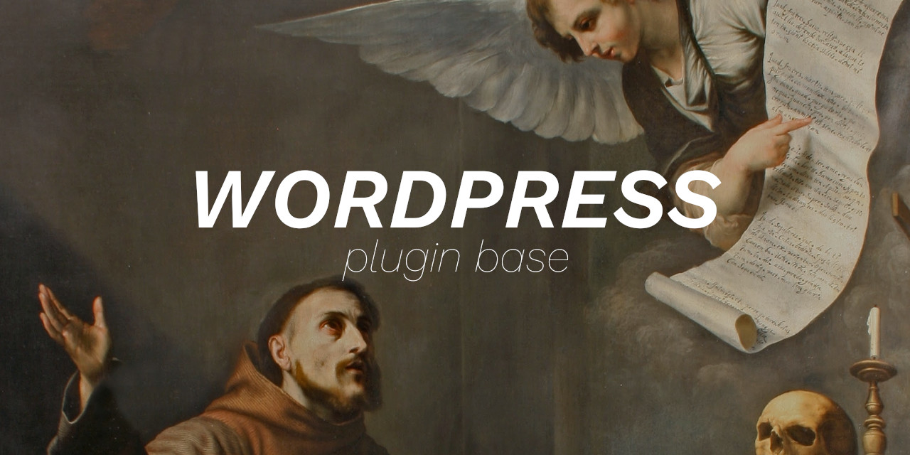

 

    
      
    
    
    
    
    
    

 

Language: <a href="readme.md">EN-US</a>

Este projeto trata-se de uma estrutura base para criar plugins Wordpress.

 

Descrição dos arquivos do diretório <b>plugin</b>:

- <b>plugin.php</b>: informações sobre o plugin e sua inicialização.
- <b>manager/controller.php</b>: configurações do plugin e controle da área de exibição (que fica dentro da Dasboard do Wordpress).

 

**Se meu código te ajudou em algo, considere [ser um patrocinador](https://github.com/sponsors/melchisedech333) :blue_heart:** 

 

:smiley: Autor
---

Patrocinar: [melchisedech333](https://github.com/sponsors/melchisedech333) 
Twitter: [Melchisedech333](https://twitter.com/Melchisedech333) 
LinkedIn: [Melchisedech Rex](https://www.linkedin.com/in/melchisedech-rex-724152235/) 
Blog: [melchisedech333.github.io](https://melchisedech333.github.io/) 

 

:scroll: Licença
---

[ BSD-3-Clause license](./license)

  

## Lembre-se de deixar   uma linda estrelinha :star_struck:

