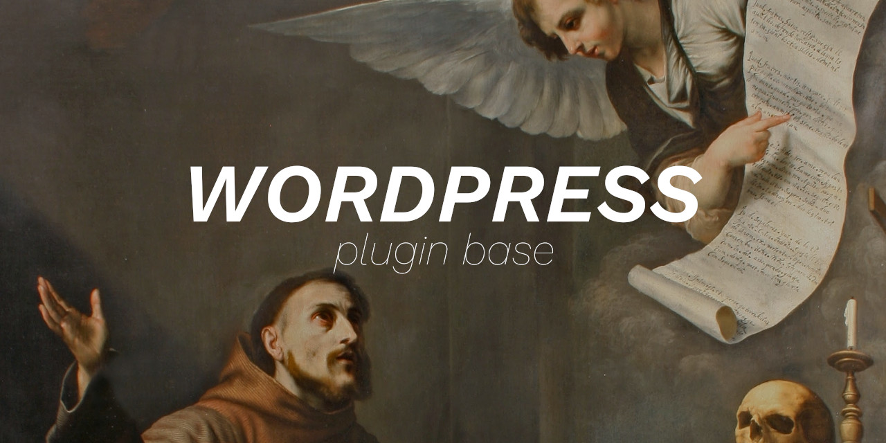

 

    
      
    
    
    
    
    
    

 

Language: <a href="readme-pt.md">PT-BR</a>

Base project used to create Wordpress plugins.

 

Description of the files in the <b>plugin</b> directory:

- <b>plugin.php</b>: information about the plugin and its startup.
- <b>manager/controller.php</b>: plugin settings and control of the display area (which is inside the Wordpress Dashboard).

 

**If my code has helped you, please consider [sponsoring me](https://github.com/sponsors/melchisedech333) :blue_heart:** 

 

:smiley: Author
---

Sponsor: [melchisedech333](https://github.com/sponsors/melchisedech333) 
Twitter: [Melchisedech333](https://twitter.com/Melchisedech333) 
LinkedIn: [Melchisedech Rex](https://www.linkedin.com/in/melchisedech-rex-724152235/) 
Blog: [melchisedech333.github.io](https://melchisedech333.github.io/) 

 

:scroll: License
---

[ BSD-3-Clause license](./license)

  

## Remember to give me   a beautiful little star :star_struck:

